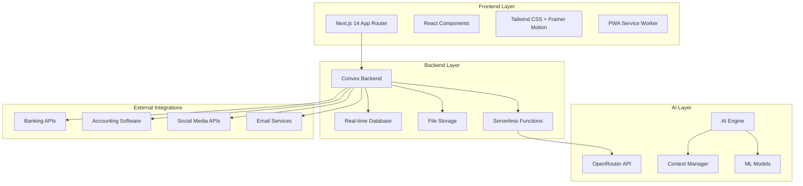
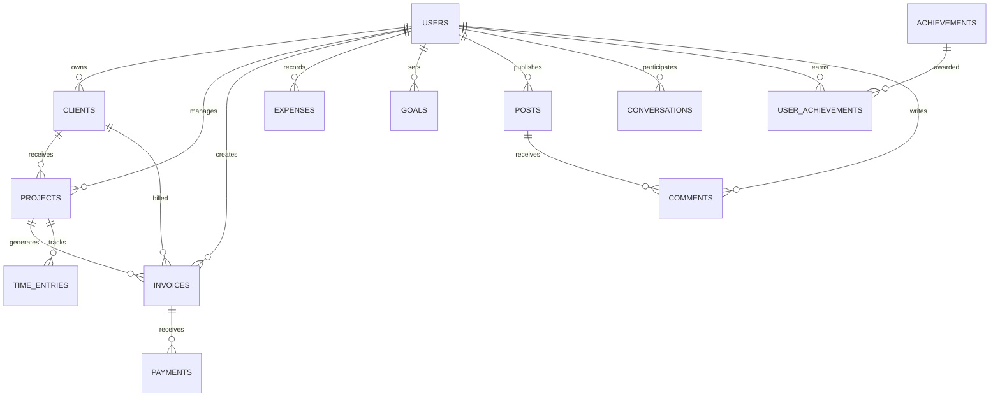

# Teendex Platform Design Document

## Overview

Teendex is a comprehensive gamified CRM platform designed for Gen Z freelancers in India. The platform combines modern web technologies with AI-powered features to create an engaging, productive business management experience. Built on Next.js 14 with Convex backend, the system provides real-time collaboration, advanced analytics, and intelligent automation.

## Architecture

### High-Level Architecture



### Technology Stack

**Frontend:**
- Next.js 14 with App Router for server-side rendering and routing
- TypeScript for type safety and developer experience
- Tailwind CSS for responsive, utility-first styling
- Framer Motion for smooth animations and transitions
- React Query for data fetching and caching
- Zustand for client-side state management
- Three.js for 3D avatar customization (optional)

**Backend:**
- Convex for real-time backend-as-a-service
- Convex Auth for authentication and authorization
- Convex File Storage for avatars, receipts, and documents
- Convex Functions for serverless business logic

**AI & ML:**
- OpenRouter API for multi-model AI access
- Custom ML models for pricing and categorization
- OCR services for receipt processing
- Natural language processing for content generation

**Integrations:**
- Banking APIs for transaction import
- Accounting software APIs (QuickBooks, Tally, Zoho)
- Social media APIs (LinkedIn, Twitter, Instagram)
- Email services for automated communications

## Components and Interfaces

### Core Application Structure

```
src/
├── app/                    # Next.js App Router pages
│   ├── (auth)/            # Authentication pages
│   ├── (dashboard)/       # Main application pages
│   ├── (onboarding)/      # Onboarding flow
│   └── api/               # API routes for external integrations
├── components/            # Reusable React components
│   ├── ui/               # Base UI components
│   ├── forms/            # Form components
│   ├── charts/           # Analytics components
│   ├── gamification/     # Gamification widgets
│   └── ai/               # AI assistant components
├── lib/                  # Utility functions and configurations
├── hooks/                # Custom React hooks
├── stores/               # Zustand stores
└── types/                # TypeScript type definitions
```

### Key Components

#### 1. Authentication System
- **ConvexAuthProvider**: Wraps the application with authentication context
- **LoginForm**: Email/password and OAuth login
- **SignupForm**: User registration with validation
- **AuthGuard**: Protects routes requiring authentication

#### 2. Onboarding Flow
- **OnboardingWizard**: Multi-step onboarding process
- **AvatarSelector**: Avatar upload and customization
- **ProfileSetup**: Basic profile information collection
- **SkillsSelector**: Skills and services selection
- **GoalSetting**: Initial business goal configuration

#### 3. Dashboard Components
- **DashboardLayout**: Main application layout with navigation
- **MetricsOverview**: Real-time KPI display
- **ActivityFeed**: Recent activities and updates
- **QuickActions**: Common action shortcuts
- **GamificationWidget**: XP, level, and achievement display

#### 4. Client Management
- **ClientList**: Searchable, filterable client directory
- **ClientCard**: Individual client summary component
- **ClientForm**: Client creation and editing
- **ClientDashboard**: Detailed client analytics
- **ClientHealthScore**: Visual health indicator

#### 5. Project Management
- **ProjectKanban**: Drag-and-drop project board
- **ProjectTable**: Tabular project view
- **ProjectForm**: Project creation and editing
- **MilestoneTracker**: Project milestone management
- **TimeTracker**: Time logging and tracking

#### 6. Invoice Management
- **InvoiceBuilder**: Multi-step invoice creation
- **InvoicePreview**: PDF preview and editing
- **InvoiceList**: Invoice management dashboard
- **PaymentTracker**: Payment status and reminders
- **RecurringInvoices**: Automated billing setup

#### 7. AI Assistant
- **DxChat**: Persistent chat interface
- **ContextProvider**: Business data context management
- **AIResponseHandler**: Streaming response processing
- **ContentGenerator**: AI-powered content creation
- **InsightsPanel**: AI-generated business insights

#### 8. Gamification System
- **XPTracker**: Experience point management
- **BadgeDisplay**: Achievement badge showcase
- **StreakCounter**: Daily/weekly streak tracking
- **Leaderboard**: Community rankings
- **ChallengeCard**: Daily/weekly challenges

#### 9. Analytics Dashboard
- **ChartContainer**: Reusable chart wrapper
- **RevenueChart**: Revenue trend visualization
- **ExpenseBreakdown**: Expense category analysis
- **ClientAnalytics**: Client performance metrics
- **PredictiveInsights**: AI-powered forecasting

#### 10. Community Features
- **CommunityFeed**: Social activity stream
- **UserProfile**: Public profile display
- **ForumThread**: Discussion thread component
- **DirectMessage**: Private messaging interface
- **MentorshipHub**: Mentor matching and sessions

### Interface Definitions

#### User Data Models

```typescript
interface User {
  _id: Id<"users">;
  email: string;
  name: string;
  avatar?: string;
  isOnboarded: boolean;
  profile: UserProfile;
  gamification: GamificationData;
  preferences: UserPreferences;
  createdAt: number;
  updatedAt: number;
}

interface UserProfile {
  displayName: string;
  age: number;
  role: string;
  location: string;
  skills: string[];
  bio?: string;
  portfolio?: PortfolioData;
  socialLinks?: SocialLinks;
}

interface GamificationData {
  xp: number;
  level: number;
  badges: Badge[];
  streaks: StreakData;
  achievements: Achievement[];
  totalEarnings: number;
}
```

#### Business Data Models

```typescript
interface Client {
  _id: Id<"clients">;
  userId: Id<"users">;
  name: string;
  email: string;
  phone?: string;
  company?: string;
  tags: string[];
  healthScore: number;
  source: string;
  notes: string;
  totalRevenue: number;
  projectCount: number;
  createdAt: number;
  updatedAt: number;
}

interface Project {
  _id: Id<"projects">;
  userId: Id<"users">;
  clientId: Id<"clients">;
  title: string;
  description: string;
  status: "planning" | "in_progress" | "completed" | "cancelled";
  budget: number;
  actualCost: number;
  startDate: number;
  endDate: number;
  milestones: Milestone[];
  timeEntries: TimeEntry[];
  createdAt: number;
  updatedAt: number;
}

interface Invoice {
  _id: Id<"invoices">;
  userId: Id<"users">;
  clientId: Id<"clients">;
  projectId?: Id<"projects">;
  invoiceNumber: string;
  status: "draft" | "sent" | "paid" | "overdue" | "cancelled";
  items: InvoiceItem[];
  subtotal: number;
  tax: number;
  total: number;
  currency: string;
  dueDate: number;
  paidDate?: number;
  notes?: string;
  createdAt: number;
  updatedAt: number;
}
```

#### AI Integration Models

```typescript
interface AIConversation {
  _id: Id<"conversations">;
  userId: Id<"users">;
  messages: AIMessage[];
  context: BusinessContext;
  createdAt: number;
  updatedAt: number;
}

interface AIMessage {
  id: string;
  role: "user" | "assistant";
  content: string;
  timestamp: number;
  metadata?: {
    model?: string;
    tokens?: number;
    confidence?: number;
  };
}

interface BusinessContext {
  totalRevenue: number;
  activeProjects: number;
  recentInvoices: Invoice[];
  topClients: Client[];
  currentGoals: Goal[];
  skillsAndServices: string[];
}
```

## Data Models

### Database Schema (Convex)

#### Core Tables

**users**
- Primary user account information
- Authentication data
- Profile and preferences
- Gamification metrics

**clients**
- Client contact information
- Relationship data
- Health scoring
- Revenue tracking

**projects**
- Project details and status
- Budget and time tracking
- Milestone management
- Client associations

**invoices**
- Invoice generation data
- Payment tracking
- Recurring billing setup
- Tax calculations

**expenses**
- Expense records
- Category classification
- Receipt storage references
- Tax deduction flags

**goals**
- User-defined objectives
- Progress tracking
- Achievement milestones
- Gamification rewards

#### Gamification Tables

**achievements**
- Badge definitions
- Unlock conditions
- Rarity classifications
- Visual assets

**user_achievements**
- User badge ownership
- Unlock timestamps
- Progress tracking
- Display preferences

**leaderboards**
- Ranking calculations
- Time-based periods
- Geographic filtering
- Category-based scoring

#### Community Tables

**posts**
- Community content
- User interactions
- Moderation status
- Engagement metrics

**messages**
- Direct messaging
- Thread management
- Read status tracking
- File attachments

**mentorship**
- Mentor-mentee relationships
- Session scheduling
- Progress tracking
- Rating systems

#### AI Tables

**conversations**
- AI chat history
- Context preservation
- Model usage tracking
- Response quality metrics

**ai_insights**
- Generated business insights
- Recommendation tracking
- User feedback
- Effectiveness metrics

### Data Relationships



## Error Handling

### Frontend Error Handling

**Error Boundaries**
- React Error Boundaries for component-level error catching
- Fallback UI components for graceful degradation
- Error reporting to monitoring services

**API Error Handling**
- Convex query/mutation error handling
- Retry mechanisms for transient failures
- User-friendly error messages
- Offline state management

**Form Validation**
- Real-time validation with Zod schemas
- Accessible error messaging
- Progressive enhancement
- Server-side validation backup

### Backend Error Handling

**Convex Function Errors**
- Structured error responses
- Error logging and monitoring
- Rate limiting and abuse prevention
- Data validation and sanitization

**AI Integration Errors**
- OpenRouter API failure handling
- Model availability checking
- Fallback response mechanisms
- Cost monitoring and limits

**External Integration Errors**
- Banking API connection failures
- Social media API rate limits
- Email service outages
- Graceful degradation strategies

### Error Recovery Strategies

**Automatic Recovery**
- Exponential backoff for API retries
- Circuit breaker patterns for external services
- Cached data fallbacks
- Background sync for offline actions

**User-Initiated Recovery**
- Manual retry buttons
- Data refresh options
- Alternative action paths
- Support contact integration

## Testing Strategy

### Frontend Testing

**Unit Testing**
- Jest and React Testing Library
- Component behavior testing
- Hook functionality testing
- Utility function testing

**Integration Testing**
- API integration testing
- User flow testing
- Cross-component interaction testing
- State management testing

**End-to-End Testing**
- Playwright for full user journeys
- Critical path testing
- Mobile responsiveness testing
- Accessibility testing

### Backend Testing

**Function Testing**
- Convex function unit tests
- Database operation testing
- Authentication flow testing
- Business logic validation

**API Testing**
- External integration testing
- Error handling validation
- Performance testing
- Security testing

### AI Testing

**Model Performance**
- Response quality assessment
- Context accuracy testing
- Fallback mechanism testing
- Cost optimization validation

**Integration Testing**
- OpenRouter API integration
- Context management testing
- Streaming response testing
- Error handling validation

### Performance Testing

**Load Testing**
- Concurrent user simulation
- Database performance testing
- API response time testing
- Resource utilization monitoring

**Optimization Testing**
- Bundle size optimization
- Image loading optimization
- Database query optimization
- Caching effectiveness testing

## Security Considerations

### Authentication & Authorization

**Multi-Factor Authentication**
- TOTP-based 2FA implementation
- Biometric authentication support
- Recovery code generation
- Session management

**Role-Based Access Control**
- User permission systems
- Resource-level authorization
- API endpoint protection
- Admin panel security

### Data Protection

**Encryption**
- Data encryption at rest
- Transport layer security
- API key encryption
- File storage encryption

**Privacy Controls**
- GDPR compliance features
- Data portability tools
- Consent management
- Data anonymization

### API Security

**Rate Limiting**
- User-based rate limits
- IP-based rate limits
- API endpoint protection
- DDoS prevention

**Input Validation**
- SQL injection prevention
- XSS protection
- CSRF protection
- File upload security

### Monitoring & Auditing

**Security Monitoring**
- Failed login attempt tracking
- Suspicious activity detection
- Security event logging
- Automated alerting

**Audit Trails**
- User action logging
- Data modification tracking
- Access pattern analysis
- Compliance reporting

## Performance Optimization

### Frontend Optimization

**Code Splitting**
- Route-based code splitting
- Component lazy loading
- Dynamic imports
- Bundle optimization

**Caching Strategies**
- Browser caching
- Service worker caching
- API response caching
- Static asset caching

**Image Optimization**
- Next.js Image component
- WebP format support
- Responsive images
- Lazy loading

### Backend Optimization

**Database Optimization**
- Query optimization
- Index management
- Connection pooling
- Caching layers

**Function Optimization**
- Cold start reduction
- Memory optimization
- Execution time monitoring
- Resource allocation

### Real-time Performance

**Convex Optimization**
- Subscription optimization
- Query batching
- Update batching
- Connection management

**WebSocket Management**
- Connection pooling
- Message queuing
- Reconnection handling
- Bandwidth optimization

## Deployment Architecture

### Infrastructure

**Hosting Platform**
- Vercel for frontend deployment
- Convex cloud for backend services
- CDN for static asset delivery
- Global edge distribution

**Environment Management**
- Development environment
- Staging environment
- Production environment
- Feature branch previews

### CI/CD Pipeline

**Automated Testing**
- Unit test execution
- Integration test runs
- E2E test automation
- Security scanning

**Deployment Process**
- Automated builds
- Environment promotion
- Database migrations
- Rollback capabilities

### Monitoring & Observability

**Application Monitoring**
- Performance metrics
- Error tracking
- User analytics
- Business metrics

**Infrastructure Monitoring**
- Server health monitoring
- Database performance
- API response times
- Resource utilization

## Scalability Considerations

### Horizontal Scaling

**Database Scaling**
- Read replica support
- Sharding strategies
- Connection pooling
- Query optimization

**API Scaling**
- Load balancing
- Auto-scaling policies
- Rate limiting
- Caching layers

### Vertical Scaling

**Resource Optimization**
- Memory usage optimization
- CPU utilization monitoring
- Storage optimization
- Network optimization

### Future Growth Planning

**Architecture Evolution**
- Microservices migration path
- Database partitioning
- Service decomposition
- Technology stack evolution

**Feature Scaling**
- Plugin architecture
- API extensibility
- Third-party integrations
- White-label solutions